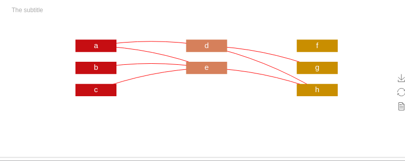

# frelation-特征构造关系
在机器学习中，构造的特征多且乱，这个库用来展示已经构造的特征关系，方便查漏补缺。

往往在构造过程中，淹没在巨量的构造函数中无法自拔。

`frelation`即`feature relation`用来展示已经构造好的特征，非常方便的查看哪些特征已经被构造，哪些特征被多次构造，构造关系如何，一目了然。

# 安装

1. 下载源文件包解压https://github.com/pipdax/frelation/tree/master/dist/frelation-0.0.1.tar.gz ，

   或者

   ```shell
   git clone https://github.com/pipdax/frelation.git
   ```

   目录结构如下

   ├── dist  
   │   └── frelation-0.0.1.tar.gz  
   ├── frelation.py  
   ├──\_\_init\_\_.py  
   ├── LICENSE  
   ├── README.md  
   ├── setup.py  
   └── show.gif  
   
   2. 使用setup.py安装

```shell
cd frelation
python setup.py install
```
**注意**:本库依赖pyecharts，如果在安装过程中，没有自动安装pyecharts，请手动安装。
```shell
pip install pyecharts
```

# 使用实例

```python
from frelation import frelation
fr = frelation("The Title", "The subtitle")
fr.addNodes(['a', 'b', 'c'], 0)
fr.addNodes(['d', 'e'], 3)
fr.addNodes(['f', 'g', 'h'], 5)
fr.addLink('a', 'd', 'g')
fr.addLink('d', 'h')
fr.addLink('b', 'e', 'h')
fr.addLinks([{'source': 'a', 'target': 'e'}, {'source': 'c', 'target': 'e'}])
fr.show()
```

# 效果展示


